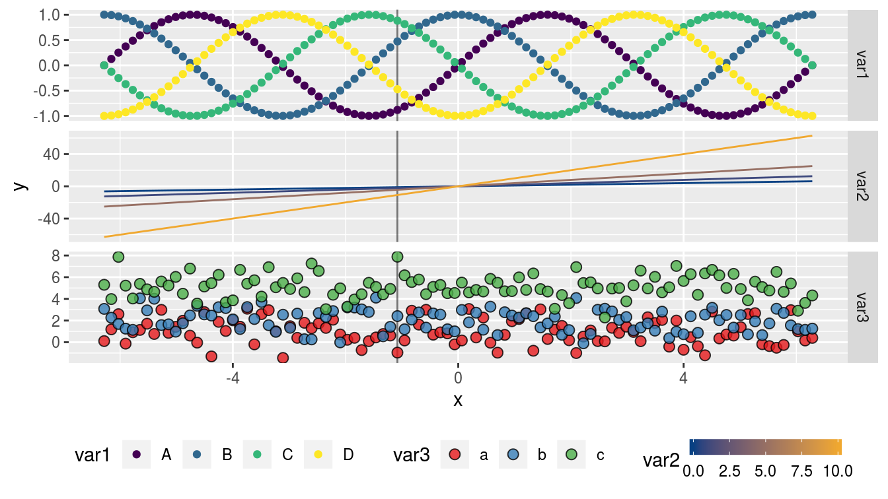

# geomfactory 

The **R** package **geomfactory** allows to create more than a single color scale within a ggplot

*This package is still under construction...*

## Install

To install **geomfactory** please run:
```
devtools::install_github("k-hench/geomfactory")
```

<center>

</center>


------------------------
