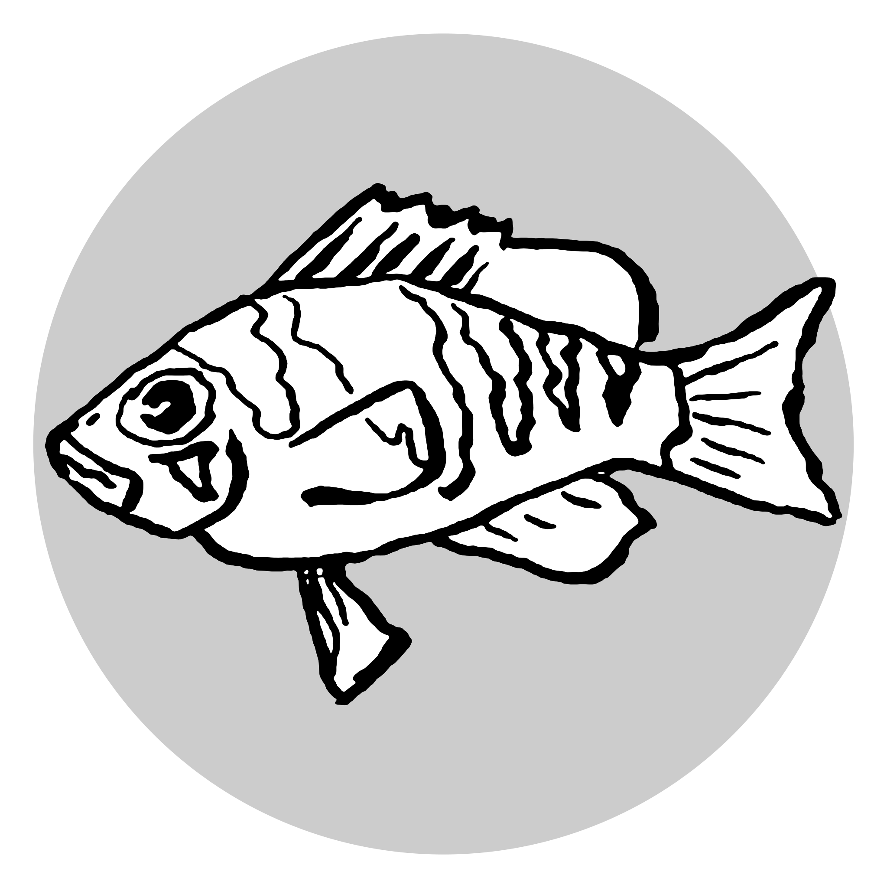

```{r setup, include=FALSE}
knitr::opts_chunk$set(echo = TRUE)
```

## About the package:

The **geomfactory** package is **evil** in that it provides infrastructure to implement several parallel color scales within a single ggplot.
This is usually not possible for good reasons, but I encountered some situations where I needed this feature:

Usually I use this approach in situations where I want to plot unrelated statistics that share the same spatial context.
An example would be a population genetic measures that are all measured for the same reference genome.
Here I might want to keep different color schemes for consistency within my project, yet still plot them together to highlight outlier regions in one measure.

The aim is *NOT to overlay* several unrelated data sets, but to use the ggplot facet functions to put them in the same context:


```{r, message = FALSE}
library(geomfactory)
ls(as.environment("package:geomfactory"))
```

After loading the package, currently there are only two new functions:
`factory_geom_line()` & `factory_geom_point()`.
This are our *geom_factorys* that will create new `geom_line()` (or `geom_point()`)
variations that will work on a alternative color scale.
The function also creates according scales `scale_*()` (one discrete, one continuous)
as well as the needed color-bar guide `guide_colourbar_*()`.

(*This might expand in the future to also include other geoms.*)

```{r, message = FALSE}
factory_geom_line('var2')
ls(.GlobalEnv)
```

We can do this for as may additional color scales as we need (using a different name for each scale).


```{r, message = FALSE}
factory_geom_point('var3')
ls(.GlobalEnv)
```

## Example

Now let see the new color scales in action:

First, we create three data sets that all refer to the same spatial system
(in this case our simple x axis), but which are otherwise unrelated:

```{r, message = FALSE}
set.seed(2)

data1 <- tibble(x = seq(-2*pi, 2*pi, length.out = 100),
       A = sin(x),
       B = cos(x),
       C = -sin(x),
       D = -cos(x)) %>% 
  gather(key = 'var1', value = 'y', 2:5) %>%
  mutate(var = 'var1')
```

These data sets include:

- a **x** value
- a **y** value
- a **varX** vale or class (that's what we want to color)
- a **var** column that is uniform within each data set (for the faceting)

```{r echo = FALSE}
data1 %>%
  DT::datatable(options = list(pageLength = 5))
```


```{r, message = FALSE}
data2<- tibble(x = seq(-2*pi, 2*pi, length.out = 100),
                `0` = x*1,
                `1` = x*2,
                `5` = x*4,
                `10` = x*10) %>% 
  gather(key = 'var2', value = 'y', 2:5, convert = TRUE) %>%
  mutate(var = 'var2')

data3 <- tibble(x = seq(-2*pi, 2*pi, length.out = 100),
                a = 1+rnorm(length(x)),
                b = 2+rnorm(length(x)),
                c = 5+rnorm(length(x))) %>% 
  gather(key = 'var3',value = 'y',2:4) %>%
  mutate(var = 'var3')
```

Finally, we can plot the three data sets in context while keeping their super important color scheme.
We can also highlight the *crazy outlier* of the class **c** within **var3**:

```{r, message = FALSE, fig.width = 7, fig.asp = 9/16}
clr_1 <- viridis::viridis(4)
clr_3 <- RColorBrewer::brewer.pal(3,'Set1')

ggplot(data1, aes(x,y))+
  geom_vline(xintercept = -1.08, color = rgb(0,0,0,.5))+
  geom_point(aes(color = var1))+
  geom_line_var2(data = data2, aes(var2 = var2, group = var2))+
  geom_point_var3(data = data3, aes(var3_f = var3), 
                  shape = 21, size = 2.5,alpha = .8)+
  scale_color_manual(values = clr_1)+
  scale_var3_f_manual(values = clr_3) +
  guides(var2 = guide_colourbar_var2(barheight = unit(9,'pt')),
         var3_f = guide_legend(override.aes = list(fill = clr_3)))+
  facet_grid(var~.,scales = 'free')+
  theme(legend.position = 'bottom')
```


------------------------

<center>

</center>
